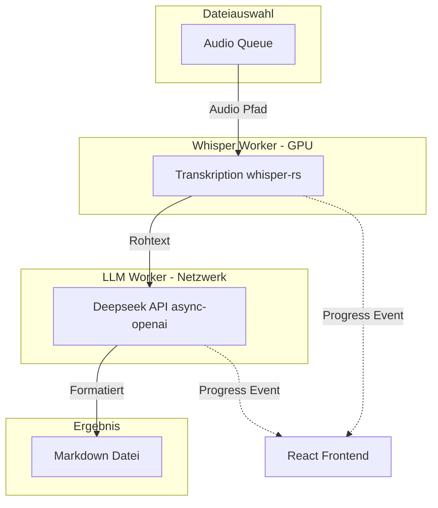

# Tauri App "VoxMD" (Rust + React)

## 1. Projekt-Setup & GitHub
- **Name:** VoxMD
- **Pfad:** `/home/rh/SynologyDrive/SourceCode/VoxMD`
- Initialisierung einer Tauri v2 App (Rust + React/TS + Vite).
- Erstellung eines privaten GitHub-Repositories via `gh cli`.
- Anlage der Struktur (`README.md`, `CHANGELOG.md`, etc.) exakt nach den Vorgaben aus `[prd_github_project.md](/home/rh/SynologyDrive/SourceCode/prd_github_project.md)`.

## 2. Rust Backend (Architektur & Pipeline)
Um die Anforderung "Parallel Bearbeitung von zwei Dateien" optimal zu lösen, bauen wir eine asynchrone Pipeline mit `tokio`:

- **Worker 1 (Whisper - GPU-gebunden):** Nimmt die nächste Audiodatei aus der Queue und führt `whisper-rs` (mit `vulkan`-Feature) aus.
- **Worker 2 (LLM - Netzwerk-gebunden):** Empfängt den fertigen Rohtext von Worker 1, ruft Deepseek via `async-openai` auf und speichert die `.md`-Datei.
- **Effekt:** Während Datei A vom LLM verarbeitet wird, transkribiert Whisper bereits Datei B.
- **State Management:** Ein globaler App-State trackt den Fortschritt und sendet Events an das Frontend (`tauri::emit`).

## 3. Frontend & GUI (Design System v1.2)
Umsetzung strikt nach `[ui_design_system_v1.2.md](/home/rh/SynologyDrive/SourceCode/ui_design_system_v1.2.md)`.

- **Layout:** 
  - Topbar (mit Dark/Light-Toggle & Config-Button)
  - Content Area (Dateiliste mit individuellen Status-Badges und Fortschrittsbalken)
  - Meta-Bar (Gesamtfortschritt der Queue).
- **Styling:** Nutzung der definierten CSS-Variablen (`--bg`, `--surface`, `--accent` `#3B5F8A`), Lucide Icons (Outline), und Status-Farben (`--status-ok`, etc.).
- **Config-Menu:** Ein Einstellungs-Panel für Deepseek API-Key, Whisper-Modell und Chunk-Größen. Speicherung erfolgt persistent via `tauri-plugin-store`.

## 4. GitHub Actions
- Einrichtung von `.github/workflows/tauri-release.yml` für automatisierte Releases (Windows `.exe`, Linux `.AppImage`/`.deb`, macOS `.dmg`) entsprechend der PRD-Vorgaben.