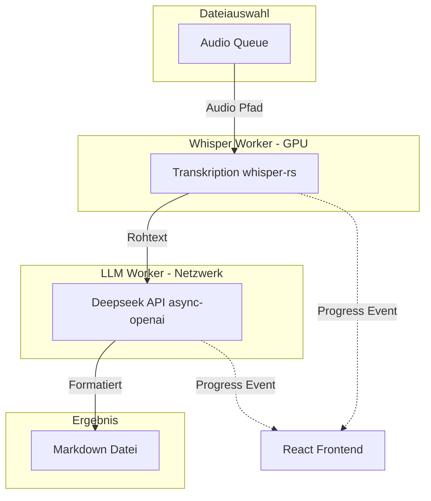

# Tauri App "VoxMD" (Rust + React)

## 1. Projekt-Setup & GitHub
- **Name:** VoxMD
- **Pfad:** `/home/rh/SynologyDrive/SourceCode/VoxMD`
- Initialisierung einer Tauri v2 App (Rust + React/TS + Vite).
- Erstellung eines privaten GitHub-Repositories via `gh cli`.
- Anlage der Struktur (`README.md`, `CHANGELOG.md`, etc.) exakt nach den Vorgaben aus `[prd_github_project.md](/home/rh/SynologyDrive/SourceCode/prd_github_project.md)`.

## 2. Rust Backend (Architektur & Pipeline)
Asynchrone Pipeline mit `tokio` und einem bounded Channel (`capacity = 1`):

- **Whisper (blocking worker):** Transkribiert nacheinander; sobald ein Rohtext fertig ist, wird er an den LLM-Kanal geschickt — der Kanal hat Platz für höchstens **ein** wartendes Ergebnis, daher maximal **ein** Whisper und **ein** LLM gleichzeitig.
- **LLM (`async`):** Verarbeitet den Rohtext (Sprecher-Zuordnung in Chunks mit Kontext-Tail, Validierung + ein Retry bei Formatfehlern), dann Zusammenfassung; schreibt Markdown.
- **Fortschritt:** `tauri::emit` (`job_progress`, `batch_complete`, `model_download_progress`).

## 3. Frontend & GUI (Design System v1.2)
Orientierung an `[ui_design_system_v1.2.md](/home/rh/SynologyDrive/SourceCode/ui_design_system_v1.2.md)`.

- **Layout:**
  - Kompakte **App-Bar** (Aktionen, Theme, Settings)
  - Dateitabelle: Spalten **File**, **Status** (Badge), **Details**
  - Meta-Bar unten (Gesamtfortschritt / Modell-Download)
- **Styling:** Nutzung der definierten CSS-Variablen (`--bg`, `--surface`, `--accent` `#3B5F8A`), Lucide Icons (Outline), und Status-Farben (`--status-ok`, etc.).
- **Config-Menu:** Ein Einstellungs-Panel für Deepseek API-Key, Whisper-Modell und Chunk-Größen. Speicherung erfolgt persistent via `tauri-plugin-store`.

## 4. GitHub Actions
- `ci.yml`: Builds auf **Linux** und **Windows** bei Push/PR zu `main`.
- `tauri-release.yml`: Releases bei Tags `v*` für **Linux** und **Windows** (Checksums `SHA256SUMS-linux.txt` / `SHA256SUMS-windows.txt`).