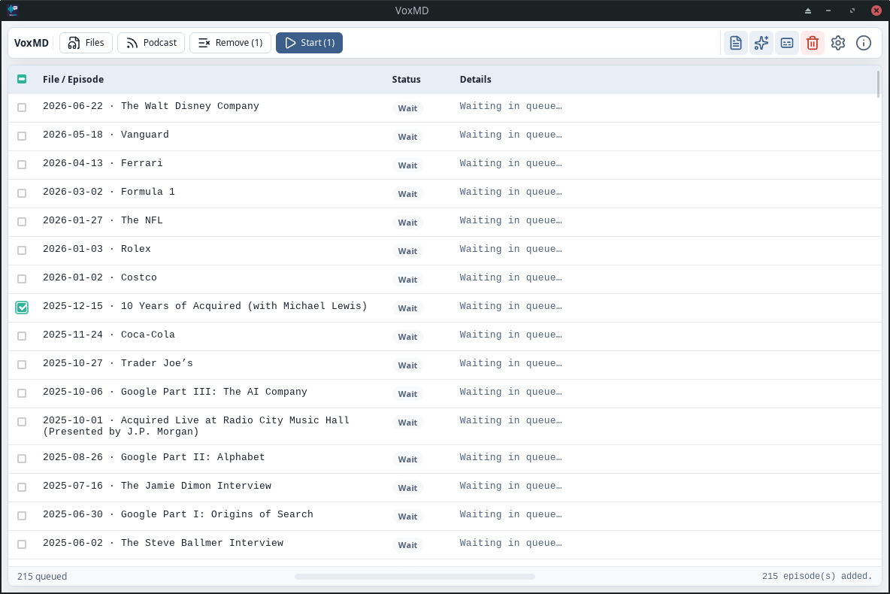

# VoxMD

**Local audio transcription with Whisper and Markdown output including LLM post-processing.**

[](./LICENSE)
[](https://github.com/fly2nbc-oss/VoxMD/releases/latest)
[](https://github.com/fly2nbc-oss/VoxMD/actions/workflows/ci.yml)
[](https://github.com/fly2nbc-oss/VoxMD/actions/workflows/ci.yml)

VoxMD is a **Tauri v2** desktop application (Rust backend, React/TypeScript frontend). It transcribes local audio files and **podcast episodes (RSS feeds)** locally using **whisper.cpp** (via `whisper-rs`), optionally generates a structured summary via an **OpenAI-compatible API** (e.g. Deepseek), and writes a **Markdown file** per source.

---

## Table of Contents

- [Screenshots](#screenshots)
- [Features](#features)
- [Quick Start](#quick-start)
- [Usage](#usage)
- [Supported Platforms & Formats](#supported-platforms--formats)
- [Development & Build](#development--build)
- [Releases](#releases)
- [Troubleshooting](#troubleshooting)
- [Roadmap & Known Issues](#roadmap--known-issues)
- [Contributing](#contributing)
- [License](#license)

---

## Screenshots



Dark mode uses the same layout; theme preference is System / Light / Dark in Settings.

## Features

- **Pipelined processing**: At most **one** Whisper transcription and **one** LLM job run at the same time (bounded queue). While the LLM works on file *n*, Whisper may transcribe file *n+1* — never more than one of each stage.
- **Podcast feeds**: Paste an RSS/Atom feed URL — VoxMD queues all episodes with audio enclosures. On **Start**, audio is downloaded into your chosen output folder (same basename as the Markdown). Recent feed URL + folder pairs are remembered (up to 10).
- **Queue management**: Add audio via the file picker or **drag & drop**; checkbox selection with **Remove**; **Start** processes only selected entries when any are checked (otherwise the full queue).
- **Configurable Markdown output** (toolbar toggles): **metadata**, **LLM summary**, and **transcript**. With the summary off, no API access is needed.
- **Progress**: Per-file **Status** badge plus **Details** (download / transcription / summary); footer shows overall queue progress and optional model-download progress.
- **English UI** with System / Light / Dark appearance; **About** via the toolbar info icon; **delete-audio toggle** (trash) deletes audio after a successful export — Markdown is always kept.
- **Settings**: Summary (LLM) API, Whisper model / language / GPU, Appearance — persisted via `@tauri-apps/plugin-store`. Without an API key, the summary is skipped and VoxMD runs fully offline.
- **Whisper models**: Preset names (e.g. `turbo`) download from Hugging Face into `~/.cache/voxmd/whisper/`; **Custom path…** + **Choose…** for a local `.bin` / `.gguf`.
- **Audio formats**: MP3, M4A, MP4, WAV, OGG, FLAC, WebM, OPUS (decoded via Symphonia).
- **Optional Vulkan**: Cargo feature `gpu-vulkan`. The loader is opened at runtime (missing `libvulkan` does not prevent startup; Whisper falls back to CPU).

## Quick Start

1. [Download a release](https://github.com/fly2nbc-oss/VoxMD/releases/latest). Both platforms ship a **portable** build next to their installers:
   - **Windows** — portable `VoxMD.exe` (no installer), or the NSIS setup `.exe`. [WebView2](https://developer.microsoft.com/en-us/microsoft-edge/webview2/) must be present on the PC.
   - **Linux** — portable `.AppImage` (`chmod +x`, then run; it carries its own WebKitGTK and GTK libraries), or the `.deb`. Use the AppImage on anything without `.deb` support — Arch, Manjaro, Fedora, openSUSE. It is built on Ubuntu 24.04 and needs glibc 2.39 or newer; on older distributions build from source.
2. Launch the app — the default Whisper model (`turbo`, ~800 MB) is **downloaded automatically** when needed (unless you point to a local model file).
3. Optionally enter your **API key** and **base URL** (e.g. `https://api.deepseek.com`) under **Summary (LLM)** in Settings and press **Save**. No key? Enable Transcript in the toolbar; the summary is skipped automatically.
4. Add **Files** (local audio) or a **Podcast** feed, optionally select entries, then press **Start**.

**Output:** a `.md` file next to each local audio file; podcast episodes write **audio + Markdown** into the folder chosen in the Podcast dialog (same stem, e.g. `2024 - Title.mp3` and `2024 - Title.md`). Existing `.md` files are skipped, so re-running a batch is idempotent.

## Usage

### Toolbar

| Control | Description |
|---|---|
| Files / Podcast / Remove / Start | Queue management; Start uses the selection when any rows are checked |
| Metadata / Summary / Transcript | Markdown sections to include (icons) |
| Trash | When active (red): delete **audio** after a successful `.md` write (local files and podcast downloads). **Markdown is never deleted.** Default: off (keep audio) |
| Settings / About | Settings drawer; About dialog |

### Settings (gear icon)

| Section | Fields | Notes |
|---|---|---|
| **Summary (LLM)** | API key, base URL, model, summary language | Used only when Summary is enabled in the toolbar. Base URL is the endpoint root (without `/v1/chat/completions`). Summary language: System or ISO. |
| **Transcription (Whisper)** | Model, transcription language, Use GPU | Preset or **Custom path…**. Language: Auto-detect (default) or ISO. GPU needs a Vulkan-capable build + loader. |
| **Appearance** | System / Light / Dark | Applied immediately |

LLM sampling is fixed internally (temperature 0.3, generous token limit) and Whisper thread count is auto-detected — these are not settings.

### Model selection

Pick a preset in the dropdown (sizes shown). A ✓ means the model is already cached. Presets without ✓ download before transcription. Choose **Custom path…** to browse or paste an absolute path to a `.bin` / `.gguf` file. **Clear cache** deletes files under `~/.cache/voxmd/whisper/`.

### Output Markdown layout

```markdown
# Title (from audio tags or episode title)

- Podcast: Feed title          ← metadata block (optional)
- Episode: Episode title
- Published: 2026-06-01
- Link: https://…

## Summary in One Sentence     ← LLM summary sections (optional)
…

## Transcript                  ← raw Whisper transcript (optional)

[HH:MM:SS] Utterance text.
```

Each section is controlled by the **Markdown output** toggles in the toolbar. Transcript lines are the raw Whisper output with `[HH:MM:SS]` timestamps; the summary quotes reference those timestamps.

## Supported Platforms & Formats

| Platform | CI / release binaries | Local build |
|----------|------------------------|-------------|
| Linux    | ✅ tested on Ubuntu runner | ✅ |
| Windows  | ✅ | ✅ |

Audio formats: MP3, M4A, MP4, WAV, OGG, FLAC, WebM, OPUS.

## Development & Build

Prerequisites: **Rust stable**, **Node LTS**, system packages for [Tauri v2](https://v2.tauri.app/start/prerequisites/).

**Linux additionally requires:**

```bash
sudo apt-get install -y libwebkit2gtk-4.1-dev libayatana-appindicator3-dev \
  librsvg2-dev patchelf clang libclang-dev llvm-dev
```

```bash
git clone https://github.com/fly2nbc-oss/VoxMD.git
cd VoxMD
npm install
npm run tauri dev
```

**Production build (CPU, default feature set):**

```bash
npm run tauri build
```

**With Vulkan / GPU Whisper** (Vulkan SDK or headers required on the build machine). The normal `tauri build` / `tauri dev` is CPU-only; use:

```bash
npm run tauri:vulkan
# or for development:
bash scripts/ensure-vulkan-sdk.sh && npx tauri dev --features gpu-vulkan
```

Vulkan-enabled binaries do not hard-depend on `libvulkan` at load time (link stub + runtime `dlopen`). Without a loader they still start and run Whisper on CPU.

## Releases

Tags matching `v*` trigger [.github/workflows/tauri-release.yml](.github/workflows/tauri-release.yml), which builds **Linux** and **Windows** packages and attaches checksum files:

| Artifact | Description |
|----------|-------------|
| `SHA256SUMS-linux.txt` | Hashes for the `.deb` and the `.AppImage` |
| `SHA256SUMS-windows.txt` | Hashes for the NSIS setup and the portable `VoxMD.exe` |

## Troubleshooting

- **Summary missing from the output** — no API key, or Summary off in the toolbar: the summary is skipped. Enter a key in Settings and enable Summary.
- **Feed loads no episodes** — VoxMD only lists entries with an audio enclosure (`<enclosure>` / media content with an `audio/*` MIME type or audio file extension). Many hosts truncate RSS to ~100 recent episodes.
- **A file is skipped with "exists"** — the target `.md` already exists; delete or rename it to re-process.
- **No audio in the podcast folder** — press **Start** first (download happens during processing). If the trash toggle is active (red), audio is removed after a successful export; Markdown stays.
- **GPU checkbox greyed out** — binary without `gpu-vulkan`, or Vulkan loader missing at runtime. The app still starts and runs on CPU.
- **AppImage window opens but stays blank (1.0.6 and earlier)** — the bundled Wayland libraries were older than the host's, so the system's Mesa EGL could not load and WebKit gave up rendering (`Could not create default EGL display: EGL_BAD_PARAMETER`). It hit rolling distributions in particular: Arch, Manjaro, Fedora 41+, openSUSE Tumbleweed. Fixed in 1.0.7. On an older AppImage, run it as `LD_PRELOAD=/usr/lib/libwayland-client.so.0 ./VoxMD_*.AppImage`.
- **Linux AppImage fails to build** — bundling requires `linuxdeploy`; the `.deb` is unaffected.

## Roadmap & Known Issues

- Whisper does not expose fine-grained percentage progress to the UI; stages **Download** / **Whisper** / **LLM** still indicate where time is spent.
- No hard cancellation of an in-flight job (status updates until the pipeline finishes); episode downloads finish before a cancel takes effect.
- Linux AppImage bundling may fail if `linuxdeploy` is missing on the runner or developer machine.

## Contributing

See [CONTRIBUTING.md](./CONTRIBUTING.md).

## License

Licensed under the Apache License, Version 2.0. See [LICENSE](./LICENSE).
